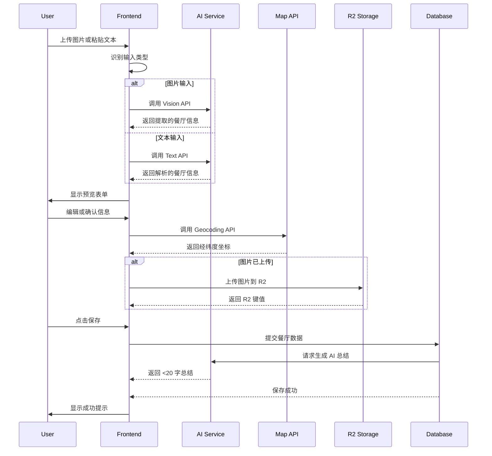

# Design Document - Spot Ingestion Feature

## Overview

餐厅录入功能允许用户通过图片上传或文本粘贴快速记录餐厅信息。系统将使用 AI Vision API 识别图片中的餐厅详情，或使用 AI 文本 API 解析分享文本，然后通过高德地图 API 进行地理编码，最终将结构化数据保存到 SQLite 数据库。

## Steering Document Alignment

### Technical Standards (tech.md)

本设计严格遵循技术指导文档中定义的架构模式：
- **静态导出 + Bun 后端**：前端为 Next.js 静态构建，后端为 Bun 轻量级 API 服务器
- **SQLite 数据库**：使用 `better-sqlite3` 或原生 SQL，避免复杂 ORM
- **API Key 保护**：所有 API 调用（AI、地图）在服务器端进行
- **内存优化**：流式处理大响应，避免加载整个数据集到内存

### Project Structure (structure.md)

遵循项目结构规范：
- `components/features/`：功能组件（Omnibar、ImageUpload、SpotForm）
- `components/forms/`：表单组件
- `lib/api/`：API 客户端封装
- `server/api/`：后端 API 路由处理器
- `server/services/`：外部 API 调用（AI、地图、R2）

## Code Reuse Analysis

### Existing Components to Leverage

- **lib/types/index.ts**：使用已定义的类型（`FoodSpot`、`CreateSpotDto`、`AiExtractionResult`）
- **lib/db/schema.ts**：数据库建表 SQL 脚本
- **app/page.tsx**：已实现的 Omnibar 组件，扩展添加图片上传和文本粘贴处理
- **server/index.ts**：Bun 服务器入口，添加新的 API 路由

### Existing Services to Extend

- **无现有服务**：需要从零开始创建以下服务：
  - `server/services/openai.ts`：OpenAI API 调用封装
  - `server/services/amap.ts`：高德地图 Geocoding API 封装
  - `server/services/r2.ts`：Cloudflare R2 对象存储封装

### Integration Points

- **API 路由**：在 `server/api/` 中添加 `/api/spots` 端点
- **前端 API 调用**：创建 `lib/api/spots.ts` 封装所有餐厅相关 API 调用
- **数据库操作**：在 `server/db/` 中添加数据库连接和查询封装

## Architecture

### Modular Design Principles

- **Single File Responsibility**：每个文件只处理一个特定关注点
  - `ImageUpload`：只负责图片选择和预览
  - `SpotForm`：只负责表单显示和验证
  - `server/api/ai.ts`：只负责 AI API 调用
- **Component Isolation**：创建小型、专注的组件而非大型单一文件
- **Service Layer Separation**：分离数据访问、业务逻辑和展示层
- **Utility Modularity**：将工具拆分为专注、单一用途的模块

### Data Flow



## Components and Interfaces

### Component 1: Omnibar（全能输入栏）

**Purpose**: 页面底部固定输入栏，支持文本粘贴和图片上传，识别用户输入类型并触发相应流程。

**Interfaces**:
```typescript
interface OmnibarProps {
  onSpotCreate: (spot: CreateSpotDto) => Promise<void>
}

interface OmnibarState {
  inputType: 'text' | 'image' | 'mixed'
  isProcessing: boolean
  previewSpot: CreateSpotDto | null
}
```

**Dependencies**:
- `ImageUpload`：图片选择和预览组件
- `lib/api/ai.ts`：AI 提取 API 调用

**Reuses**:
- 已存在的 Omnibar 样式和布局

### Component 2: ImageUpload（图片上传）

**Purpose**: 支持用户选择图片文件，显示预览，并转换为 Base64（临时方案）或上传到 R2。

**Interfaces**:
```typescript
interface ImageUploadProps {
  onImageSelect: (file: File) => void
  onImageUpload?: (r2Key: string) => Promise<void>
  maxFileSize?: number // 默认 5MB
  acceptedTypes?: string[] // 默认 ['image/jpeg', 'image/png', 'image/webp']
}

interface ImageUploadState {
  selectedFile: File | null
  previewUrl: string | null
  isUploading: boolean
  uploadProgress: number
}
```

**Dependencies**:
- 无直接依赖

**Reuses**:
- Tailwind CSS 样式类

### Component 3: SpotForm（餐厅表单）

**Purpose**: 显示 AI 提取的餐厅信息，允许用户编辑和确认，最后保存到数据库。

**Interfaces**:
```typescript
interface SpotFormProps {
  initialData: CreateSpotDto
  isEditing: boolean
  onCancel: () => void
  onSave: (data: CreateSpotDto) => Promise<void>
}

interface SpotFormState {
  formData: CreateSpotDto
  isSaving: boolean
  errors: Record<string, string>
}
```

**Dependencies**:
- `lib/api/spots.ts`：餐厅 API 调用

**Reuses**:
- `lib/types/index.ts`：类型定义

## Data Models

### Model 1: CreateSpotDto（创建餐厅数据传输对象）

```typescript
interface CreateSpotDto {
  name: string              // 必填
  lat: number              // 必填（地理编码后获得）
  lng: number              // 必填（地理编码后获得）
  address_text?: string
  city?: string
  summary?: string           // AI 生成，<20 字符
  my_notes?: string
  tags?: string[]           // 存储为 JSON 字符串
  rating?: number
  price?: number
  original_share_text?: string
  screenshot_r2_key?: string
}
```

### Model 2: AiExtractionResult（AI 提取结果）

```typescript
interface AiExtractionResult {
  name: string
  address_text?: string
  price?: number
  rating?: number
  dishes?: string[]
  vibe?: string
  summary: string           // <20 字符，AI 生成
}
```

### Model 3: GeocodingResult（地理编码结果）

```typescript
interface GeocodingResult {
  formatted_address: string
  province: string
  city: string
  district: string
  township: string
  adcode: string
  location: {
    lng: number
    lat: number
  }
}
```

## Error Handling

### Error Scenarios

#### Scenario 1: AI 识别失败

**Description**: AI Vision 或文本 API 返回错误或超时

**Handling**:
- 显示用户友好的错误消息："AI 识别失败，请手动填写信息"
- 允许用户手动输入所有字段
- 记录错误到服务器日志（API 端点、错误类型、错误消息）

**User Impact**: 用户看到提示，可以继续手动录入，功能不受阻

#### Scenario 2: 地理编码失败

**Description**: 高德地图 API 返回错误或无法找到地址

**Handling**:
- 显示错误提示："无法获取位置信息，请手动输入或编辑坐标"
- 提供 lat/lng 手动输入字段
- 原地址文本保留，供用户参考

**User Impact**: 用户可以手动输入坐标，不强制依赖自动地理编码

#### Scenario 3: 图片上传失败（R2）

**Description**: Cloudflare R2 上传失败

**Handling**:
- 降级到 Base64 存储（开发环境）
- 显示错误："图片上传失败，使用 Base64 存储"
- 记录错误到日志

**User Impact**: 功能仍可用，仅存储方式不同

#### Scenario 4: 数据验证失败

**Description**: 用户提交数据时，必填字段缺失或格式错误

**Handling**:
- 客户端验证：显示红色边框和错误提示
- 服务器端验证：返回 400 Bad Request 和详细错误信息
- 阻止提交直到所有必填字段有效

**User Impact**: 用户看到清晰的错误提示，知道如何修正

#### Scenario 5: 网络超时

**Description**: API 调用超时（AI、地图、R2）

**Handling**:
- 超时时间：AI API 10 秒，地图 API 5 秒，R2 30 秒
- 最多重试 2 次（指数退避：1s, 2s）
- 重试失败后显示错误："网络超时，请稍后重试"

**User Impact**: 用户收到超时提示，可以手动重试

## API Design

### Backend API Endpoints

#### POST /api/spots

**Purpose**: 创建新的餐厅记录

**Request**:
```typescript
{
  name: string
  lat: number
  lng: number
  address_text?: string
  city?: string
  summary?: string
  my_notes?: string
  tags?: string[]
  rating?: number
  price?: number
  original_share_text?: string
  screenshot_r2_key?: string
}
```

**Response** (201 Created):
```typescript
{
  id: number
  ...all fields from request
  created_at: string
}
```

**Response** (400 Bad Request):
```typescript
{
  error: string
  details: {
    field: string
    message: string
  }[]
}
```

#### POST /api/ai/extract

**Purpose**: 使用 AI 提取图片或文本中的餐厅信息

**Request** (图片):
```typescript
{
  type: 'image' | 'text'
  image?: string // Base64
  text?: string
}
```

**Response** (200 OK):
```typescript
{
  success: boolean
  data: AiExtractionResult | null
  error?: string
}
```

#### POST /api/ai/geocode

**Purpose**: 将地址文本转换为经纬度坐标

**Request**:
```typescript
{
  address: string
  city?: string
}
```

**Response** (200 OK):
```typescript
{
  success: boolean
  data?: {
    lat: number
    lng: number
    formatted_address: string
  }
  error?: string
}
```

#### POST /api/upload/r2

**Purpose**: 上传图片到 Cloudflare R2

**Request**: `multipart/form-data`
```
file: File
```

**Response** (200 OK):
```typescript
{
  success: boolean
  data: {
    key: string
    url: string
  }
  error?: string
}
```

### Frontend API Client

**lib/api/spots.ts** - 封装所有餐厅相关 API 调用

```typescript
export async function createSpot(data: CreateSpotDto): Promise<FoodSpot>
export async function extractSpotInfo(input: { type: 'image' | 'text'; image?: string; text?: string }): Promise<AiExtractionResult>
export async function geocodeAddress(address: string, city?: string): Promise<{ lat: number; lng: number }>
export async function uploadImageToR2(file: File): Promise<{ key: string; url: string }>
```

## Testing Strategy

### Unit Testing

**测试方法**: 使用 Vitest（轻量级，适合 Bun 环境）

**关键组件测试**:
- `ImageUpload`：测试文件选择、预览、类型验证
- `SpotForm`：测试表单验证、提交逻辑
- `lib/format.ts`：测试距离格式化、地址格式化工具函数

**测试示例**:
```typescript
describe('ImageUpload', () => {
  it('should reject file type not in accepted types', () => {
    const file = new File(['content'], 'test.txt', { type: 'text/plain' })
    expect(validateFileType(file)).toBe(false)
  })

  it('should accept valid image file', () => {
    const file = new File(['content'], 'test.jpg', { type: 'image/jpeg' })
    expect(validateFileType(file)).toBe(true)
  })
})
```

### Integration Testing

**测试方法**: 手动测试端到端流程

**关键流程测试**:
1. **图片录入流程**：上传图片 → AI 识别 → 用户确认 → 地理编码 → 保存
2. **文本录入流程**：粘贴文本 → AI 解析 → 用户确认 → 地理编码 → 保存
3. **错误处理流程**：测试 AI 失败、地理编码失败、网络超时等场景

**测试检查点**:
- 数据是否正确保存到 SQLite
- R2 键值是否正确存储
- AI 总结是否生成并限制在 20 字符内
- 错误消息是否友好且准确

### End-to-End Testing

**测试方法**: 在开发环境中手动测试完整用户旅程

**用户场景**:

#### 场景 1：用户上传美团截图
1. 点击 Omnibar 中的图片上传按钮
2. 选择美团餐厅详情页截图
3. 等待 AI 识别完成（<5 秒）
4. 查看提取的信息：店名、地址、评分、价格
5. 编辑不正确的信息
6. 点击保存按钮
7. 等待地理编码完成
8. 验证餐厅显示在时间线首页

#### 场景 2：用户粘贴小红书分享文本
1. 在 Omnibar 输入框中粘贴文本
2. 系统自动识别为文本输入
3. 等待 AI 解析完成（<3 秒）
4. 查看解析结果
5. 修正缺失字段（如手动添加标签）
6. 点击保存
7. 验证数据保存成功

#### 场景 3：AI 识别失败
1. 上传图片
2. AI 识别失败（模拟网络错误）
3. 系统显示错误提示
4. 用户手动输入餐厅信息
5. 成功保存记录

## Performance Considerations

### 响应时间目标

| 操作 | 目标 | 优化策略 |
|------|--------|-----------|
| AI Vision 识别 | <5 秒 | 使用流式上传，并行处理 |
| AI 文本解析 | <3 秒 | 缓存常用提示词 |
| 地理编码 | <2 秒 | 客户端缓存结果 |
| 图片上传（R2） | <3 秒 | 使用分块上传 |
| 数据库写入 | <500ms | 使用参数化查询，批量插入 |
| 前端渲染 | <100ms | 虚拟列表，懒加载 |

### 内存优化

- **图片处理**：不将完整图片加载到内存，使用流式读取
- **AI 响应**：只保存必要字段，不缓存原始响应
- **数据库查询**：使用 LIMIT 限制结果集，避免大表扫描
- **前端状态**：使用分页或无限滚动，不加载所有数据

### 缓存策略

- **地理编码缓存**：相同地址的地理编码结果缓存 24 小时
- **AI 提示词缓存**：预编译常用的系统提示词
- **R2 URL 缓存**：缓存图片的公共 URL，避免重复上传

## Security Considerations

### API Key 保护

- **服务器端调用**：所有 AI 和地图 API Key 存储在环境变量中
- **不暴露给客户端**：前端通过 `/api/*` 间接调用，不直接访问 Key
- **配置验证**：启动时验证必需的环境变量是否存在

### 输入验证

- **SQL 注入防护**：使用参数化查询，不接受直接字符串拼接
- **XSS 防护**：React 默认转义，用户输入显示时使用 `dangerouslySetInnerHTML` 谨慎
- **文件类型验证**：服务器端验证上传文件的 MIME 类型
- **文件大小限制**：限制上传文件最大 5MB

### CORS 配置

- **R2 Bucket**：配置 CORS 允许前端域名访问
- **API 端点**：配置 Bun 服务器的 CORS 头
- **同源策略**：开发时允许 localhost，生产时指定域名

## Deployment Notes

### 环境变量要求

```bash
# AI 配置（必需）
OPENAI_API_KEY=sk-xxx
OPENAI_BASE_URL=https://api.openai.com/v1
OPENAI_MODEL=gpt-4o

# 地图配置（必需）
AMAP_KEY=your_amap_key_here

# Cloudflare R2（可选，用于图片存储）
R2_ACCESS_KEY_ID=
R2_SECRET_ACCESS_KEY=
R2_BUCKET_NAME=gourmetlog-images

# 数据库路径（开发用）
DATABASE_PATH=./data/gourmetlog.db
```

### Bun 服务器配置

- **端口**: 3001（可配置）
- **超时**: AI API 10s，地图 API 5s，R2 30s
- **并发限制**: 单用户，无需并发控制
- **日志级别**: `info`（生产环境）

### Nginx 配置补充

```nginx
# 添加到现有的 nginx.conf
location /api/upload {
    client_max_body_size 5M;  # 最大上传文件大小
    proxy_pass http://127.0.0.1:3001;
}
```

### PM2 进程管理

使用 `ecosystem.config.cjs` 管理 Bun 进程：
- 自动重启：崩溃后自动重启
- 内存限制：100MB
- 日志轮转：每日归档日志文件

---
**Status**: ✅ Approved
**Approved At**: 2026-01-03T02:45:00Z
